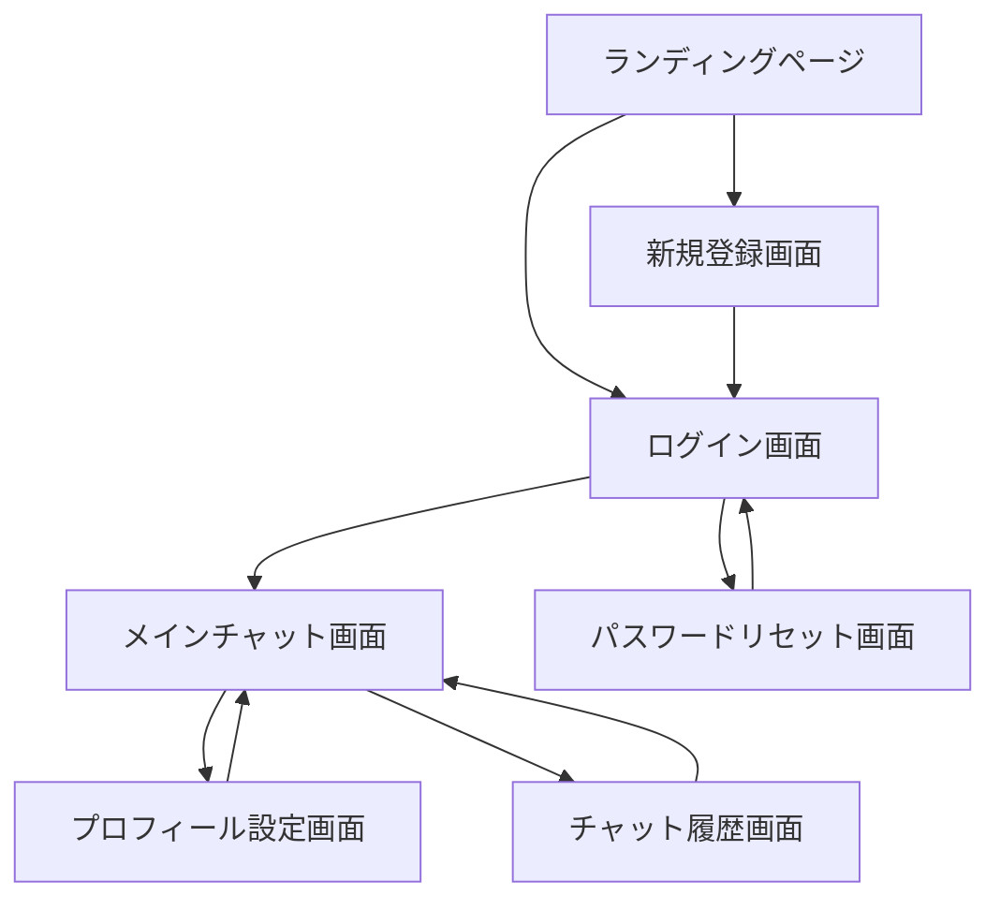

# SoulMate Chat 画面設計書

## 1. 画面遷移図

## 2. 画面詳細設計

### 2.1 ランディングページ
#### 画面概要
- サービスの概要説明と新規登録・ログインへの導線を提供
#### 主要コンポーネント
- ヘッダー
  - サービスロゴ
  - ログインボタン
  - 新規登録ボタン
- メインビジュアル
  - キャッチコピー
  - サービス説明
- フッター
  - 利用規約リンク
  - プライバシーポリシーリンク

### 2.2 ログイン画面
#### 画面概要
- ユーザー認証を行うための画面
#### 主要コンポーネント
- ログインフォーム
  - メールアドレス入力欄
  - パスワード入力欄
  - ログインボタン
- その他のオプション
  - パスワードリセットリンク
  - 新規登録リンク
- エラーメッセージ表示エリア

### 2.3 新規登録画面
#### 画面概要
- 新規ユーザー登録のための画面
#### 主要コンポーネント
- 登録フォーム
  - メールアドレス入力欄
  - パスワード入力欄
  - パスワード確認入力欄
  - 利用規約同意チェックボックス
  - 登録ボタン
- エラーメッセージ表示エリア

### 2.4 メインチャット画面
#### 画面概要
- AIとのチャットを行うメイン画面
#### 主要コンポーネント
- サイドバー
  - テーマ情報表示
    - 選択されたテーマのタイトル
    - テーマの説明
  - アプローチ選択リスト
    - 5つの異なるアプローチオプション
    - 現在選択中のアプローチの強調表示
  - チャット情報
    - チャットの使い方ガイド
    - 注意事項
- チャットエリア
  - メッセージ表示エリア
    - テーマ選択メッセージ（ユーザー側、青色）
    - システム応答メッセージ（白色）
    - アプローチ選択メッセージ（ユーザー側、青色）
    - ユーザーメッセージ（右寄せ）
    - AIメッセージ（左寄せ）
  - メッセージ入力エリア
    - テキスト入力欄
    - 送信ボタン
    - 添付ファイルボタン（将来実装）
    - 音声入力ボタン（将来実装）
- ヘッダー
  - テーマ選択に戻るボタン
  - 現在のテーマ表示

#### メッセージの表示形式
1. テーマ選択時
   - ユーザー: "[テーマ]について、相談させてください。"（青色）
   - システム: "はい、具体的な状況をお聞かせいただけますでしょうか。"（白色）

2. アプローチ変更時
   - ユーザー: "[テーマ]について、[アプローチの内容]"（青色）
   - システム: "アプローチを変更しました。新しい視点からお話を伺わせていただきます。"（白色）

### 2.5 プロフィール設定画面
#### 画面概要
- ユーザープロフィールの編集画面
#### 主要コンポーネント
- プロフィール編集フォーム
  - プロフィール画像アップロード
  - 表示名入力欄
  - 自己紹介文入力欄
  - メールアドレス変更
  - パスワード変更
- 設定オプション
  - 通知設定
  - テーマ設定（ダーク/ライトモード）
- 保存ボタン

### 2.6 チャット履歴画面
#### 画面概要
- 過去のチャット履歴を表示・管理する画面
#### 主要コンポーネント
- 履歴リスト
  - 日付別セクション
  - チャットタイトル
  - プレビューテキスト
- 検索機能
  - 検索バー
  - フィルターオプション
- アクションボタン
  - エクスポート
  - 削除

### 2.7 パスワードリセット画面
#### 画面概要
- パスワードの再設定を行う画面
#### 主要コンポーネント
- メールアドレス入力フォーム
- リセットリンク送信ボタン
- 新規パスワード設定フォーム（リンククリック後）
  - 新パスワード入力欄
  - パスワード確認入力欄
  - 保存ボタン

## 3. 共通UI要素

### 3.1 ヘッダー
- サービスロゴ（ホームへのリンク）
- ナビゲーションメニュー
- ユーザーアイコン/メニュー

### 3.2 フッター
- コピーライト表示
- 各種リンク（利用規約、プライバシーポリシー等）
- ソーシャルメディアリンク

### 3.3 エラー表示
- エラーメッセージの表示方法
  - インライン表示（フォーム項目下）
  - トースト通知
  - モーダルダイアログ

### 3.4 ローディング表示
- スピナー
- プログレスバー
- スケルトンローディング

## 4. レスポンシブデザイン対応

### 4.1 ブレークポイント
- モバイル: 〜767px
- タブレット: 768px〜1023px
- デスクトップ: 1024px〜

### 4.2 モバイル対応
- ハンバーガーメニュー
- スワイプジェスチャー
- モバイルフレンドリーな入力フォーム

### 4.3 タブレット対応
- 2カラムレイアウト
- タッチ操作の最適化

### 4.4 デスクトップ対応
- 3カラムレイアウト
- ショートカットキー対応
- ホバーエフェクト

## 5. アクセシビリティ対応

### 5.1 WAI-ARIA
- 適切なランドマーク
- ARIA属性の使用
- フォーカス管理

### 5.2 キーボード操作
- タブ移動順序の最適化
- ショートカットキーの実装
- フォーカスインジケータ

### 5.3 色とコントラスト
- WCAG 2.1準拠
- ハイコントラストモード対応
- カラーユニバーサルデザイン 