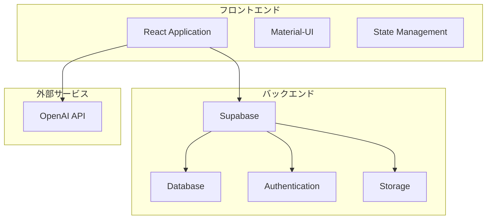
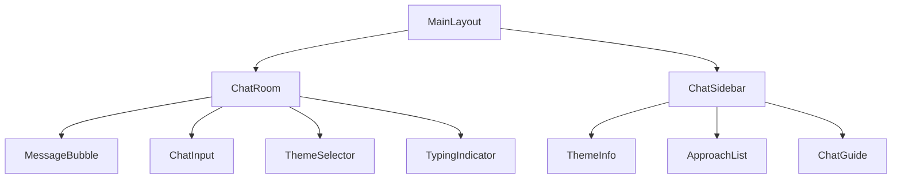
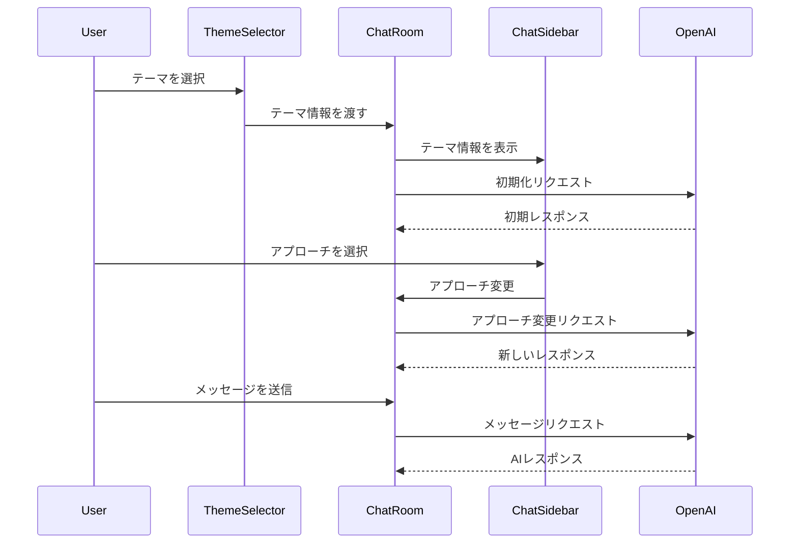
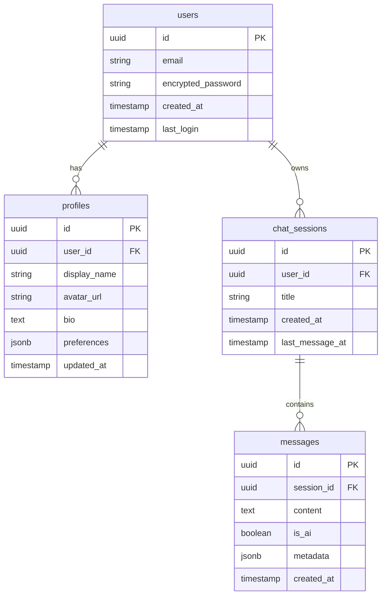
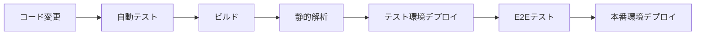

# SoulMate Chat システム設計書

## 1. システムアーキテクチャ

### 1.1 全体構成図



### 1.2 技術スタック詳細
#### フロントエンド
- React 18.x
- TypeScript 5.x
- Material-UI (MUI) 5.x
- React Router 6.x
- Zustand（状態管理）
- Axios（APIクライアント）
- Socket.io-client（WebSocket）

#### バックエンド（Supabase）
- PostgreSQL 14.x
- Supabase Auth
- Supabase Realtime
- Supabase Storage
- Edge Functions

#### 外部API
- OpenAI API（GPT-4）
- Cloudinary（画像最適化）

## 2. システムコンポーネント設計

### 2.1 フロントエンドアーキテクチャ

#### ディレクトリ構造
```
src/
├── assets/          # 静的ファイル
├── components/      # 共通コンポーネント
├── features/        # 機能別モジュール
├── hooks/          # カスタムフック
├── layouts/        # レイアウトコンポーネント
├── lib/            # ユーティリティ関数
├── pages/          # ページコンポーネント
├── services/       # APIサービス
├── stores/         # 状態管理
└── types/          # 型定義
```

#### 主要コンポーネント
- `AuthProvider`: 認証状態管理
- `ChatProvider`: チャットセッション管理
- `ThemeProvider`: テーマ設定管理
- `SocketProvider`: WebSocket接続管理

#### チャットコンポーネント構成


#### チャットフロー


#### メッセージフロー制御
```typescript
interface MessageFlow {
  // テーマ選択時のメッセージ
  themeSelection: {
    user: string;    // "[テーマ]について、相談させてください。"
    system: string;  // "はい、具体的な状況をお聞かせいただけますでしょうか。"
  };
  
  // アプローチ変更時のメッセージ
  approachChange: {
    user: string;    // "[テーマ]について、[アプローチの内容]"
    system: string;  // "アプローチを変更しました。新しい視点からお話を伺わせていただきます。"
  };
  
  // 通常のチャットメッセージ
  chat: {
    user: string;    // ユーザーの入力メッセージ
    system: string;  // AIのレスポンス
  };
}
```

### 2.2 データベース設計

#### ERD図


### 2.3 API設計

#### RESTful API エンドポイント
```
/api/v1/
├── auth/
│   ├── register     POST
│   ├── login        POST
│   ├── logout       POST
│   └── reset        POST
├── profile/
│   ├── get          GET
│   └── update       PUT
├── chat/
│   ├── sessions     GET
│   ├── create       POST
│   ├── messages     GET
│   └── send         POST
└── settings/
    ├── get          GET
    └── update       PUT
```

#### WebSocket イベント
- `chat:connect`: チャット接続
- `chat:message`: メッセージ送受信
- `chat:typing`: 入力中状態
- `chat:read`: 既読状態

## 3. セキュリティ設計

### 3.1 認証・認可
- JWTベースの認証
- ROLESベースのアクセス制御
- セッション管理
- OAuth2.0対応（将来拡張用）

### 3.2 データ保護
- データの暗号化（AES-256）
- TLS 1.3による通信暗号化
- センシティブデータのマスキング
- バックアップの暗号化

### 3.3 セキュリティ対策
- XSS対策
  - Content Security Policy
  - 入力サニタイズ
- CSRF対策
  - トークンベース
- レート制限
  - IPベース
  - ユーザーベース

## 4. パフォーマンス設計

### 4.1 最適化戦略
- コード分割（Code Splitting）
- 遅延読み込み（Lazy Loading）
- キャッシュ戦略
  - ブラウザキャッシュ
  - アプリケーションキャッシュ
  - APIキャッシュ

### 4.2 パフォーマンス目標
- First Contentful Paint: < 1.5秒
- Time to Interactive: < 3.0秒
- Largest Contentful Paint: < 2.5秒
- Cumulative Layout Shift: < 0.1

### 4.3 スケーラビリティ
- 水平スケーリング対応
- キャッシュレイヤーの導入
- マイクロサービス化の準備

## 5. 監視・運用設計

### 5.1 監視項目
- システムメトリクス
  - CPU使用率
  - メモリ使用率
  - ディスク使用率
- アプリケーションメトリクス
  - レスポンスタイム
  - エラーレート
  - アクティブユーザー数
- ビジネスメトリクス
  - DAU/MAU
  - チャットセッション数
  - ユーザー継続率

### 5.2 ログ管理
- アプリケーションログ
- アクセスログ
- エラーログ
- セキュリティログ

### 5.3 バックアップ戦略
- データベース
  - フルバックアップ（日次）
  - 差分バックアップ（1時間毎）
- ユーザーデータ
  - 継続的バックアップ
- 設定ファイル
  - バージョン管理

## 6. 開発・運用フロー

### 6.1 開発環境
- ローカル開発環境
- テスト環境
- ステージング環境
- 本番環境

### 6.2 CI/CD パイプライン


### 6.3 品質管理
- ユニットテスト
- 統合テスト
- E2Eテスト
- パフォーマンステスト
- セキュリティテスト

## 7. エラーハンドリング

### 7.1 フロントエンド
- グローバルエラーバウンダリ
- ネットワークエラー処理
- 入力バリデーション
- オフライン対応

### 7.2 バックエンド
- エラーログ収集
- エラーレスポンス標準化
- リトライ機構
- フォールバック処理

## 8. 拡張性設計

### 8.1 将来の拡張ポイント
- 多言語対応
- マルチAIモデル対応
- ファイル添付機能
- 音声チャット機能
- ビデオチャット機能

### 8.2 アーキテクチャの拡張性
- マイクロサービス化
- サーバーレスアーキテクチャ
- コンテナ化対応
- クラウドネイティブ化 